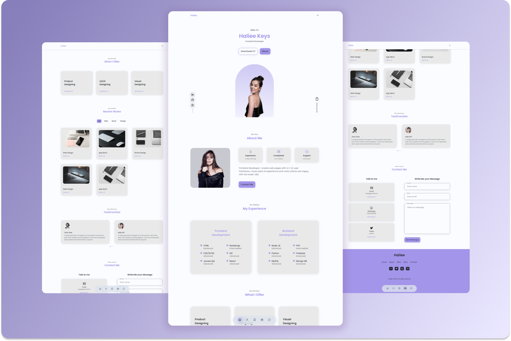

# 🏥 Vinit Kumar - Medical Student Portfolio

A modern, responsive portfolio website showcasing Vinit Kumar's medical expertise, services, and professional background. Built with HTML, CSS, and JavaScript featuring a beautiful dark/light theme toggle and interactive components.



## ✨ Features

- **🎨 Modern Design**: Clean, professional medical-themed design
- **🌓 Theme Toggle**: Dark and light mode with smooth transitions
- **📱 Fully Responsive**: Optimized for all devices and screen sizes
- **🎭 Interactive Components**: 
  - Swiper testimonials carousel
  - Scroll reveal animations
  - Service modals
  - Smooth scrolling navigation
- **⚡ Performance**: Fast loading with optimized assets
- **🔍 SEO Friendly**: Proper meta tags and semantic HTML

## 🚀 Live Demo

[View Live Portfolio](https://your-portfolio-url.com)

## 🛠️ Technologies Used

- **Frontend**: HTML5, CSS3, JavaScript (ES6+)
- **CSS Framework**: Custom CSS with CSS Variables
- **Icons**: Boxicons
- **Animations**: ScrollReveal.js
- **Carousel**: Swiper.js
- **Filtering**: MixItUp.js
- **Design**: Modern glassmorphism and card-based layout

## 📁 Project Structure

```
Vinit Portfolio/
├── assets/
│   ├── css/
│   │   ├── styles.css
│   │   └── swiper-bundle.min.css
│   ├── js/
│   │   ├── main.js
│   │   ├── mixitup.min.js
│   │   ├── scrollreveal.min.js
│   │   └── swiper-bundle.min.js
│   ├── img/
│   │   ├── about.jpg
│   │   ├── vinit.png
│   │   ├── testimonial1.png
│   │   ├── testimonial2.png
│   │   ├── testimonial3.png
│   │   └── work*.jpg
│   ├── pdf/
│   │   └── vinit_cv.pdf
│   └── favicons/
├── index.html
├── README.md
└── preview/
    ├── hailee-light.png
    └── hailee-dark.png
```

## 🎯 Key Sections

### 1. **Home Section**
- Professional introduction
- Download CV functionality
- Social media links
- Smooth scroll navigation

### 2. **About Section**
- Personal background
- Medical expertise highlights
- Skills and achievements
- Professional photo

### 3. **Services Section**
- **Medical Counseling**: Health guidance and patient support
- **Medical Writing**: Research papers and health content
- **Pharmacy Guidance**: Drug information and patient care

### 4. **Testimonials**
- Interactive carousel with Swiper.js
- Client feedback and reviews
- Professional endorsements

### 5. **Contact Section**
- Multiple contact methods
- Contact form
- Social media integration

## 🚀 Getting Started

### Prerequisites
- Modern web browser
- Basic knowledge of HTML/CSS/JavaScript (for customization)

### Installation

1. **Clone the repository**
   ```bash
   git clone https://github.com/yourusername/vinit-portfolio.git
   cd vinit-portfolio
   ```

2. **Open in browser**
   - Simply open `index.html` in your web browser
   - Or use a local server for development

3. **Customize content**
   - Edit `index.html` for content changes
   - Modify `assets/css/styles.css` for styling
   - Update `assets/js/main.js` for functionality

## 🎨 Customization

### Changing Colors
The portfolio uses CSS variables for easy color customization:

```css
:root {
  --first-color: #a789d4;
  --first-color-alt: #8b6bb3;
  --title-color: #0c0c0c;
  --text-color: #0c0c0c;
  --text-color-light: #6e6e6e;
  --body-color: #fafafa;
  --container-color: #ffffff;
}
```

### Adding New Sections
1. Add HTML structure in `index.html`
2. Style with CSS classes
3. Add JavaScript functionality if needed

### Updating Content
- **Personal Info**: Edit the HTML content directly
- **Images**: Replace files in `assets/img/` folder
- **CV**: Update `assets/pdf/vinit_cv.pdf`

## 📱 Responsive Breakpoints

- **Mobile**: < 576px
- **Tablet**: 576px - 768px
- **Desktop**: > 768px
- **Large Desktop**: > 992px

## 🌟 Features in Detail

### Theme Toggle
- Smooth transition between dark/light modes
- Persistent theme selection (localStorage)
- Automatic icon changes

### Smooth Scrolling
- Navigation links with smooth scrolling
- Active section highlighting
- Scroll-triggered animations

### Interactive Elements
- Service modals with detailed information
- Testimonial carousel with pagination
- Hover effects and transitions

## 🔧 Browser Support

- ✅ Chrome (latest)
- ✅ Firefox (latest)
- ✅ Safari (latest)
- ✅ Edge (latest)
- ⚠️ Internet Explorer (not supported)

## 📄 License

This project is licensed under the MIT License - see the [LICENSE](LICENSE) file for details.

## 👨‍⚕️ About Vinit Kumar

Vinit Kumar is a dedicated medical and pharmacy student currently in his 3rd year. He specializes in:

- **Hospital Pharmacy**: Patient care and medication management
- **Pharmacology**: Drug interactions and therapeutic effects
- **Patient Counseling**: Health guidance and lifestyle advice
- **Medical Writing**: Research papers and health content creation

## 🤝 Contributing

Contributions are welcome! Please feel free to submit a Pull Request.

### How to Contribute

1. Fork the project
2. Create your feature branch (`git checkout -b feature/AmazingFeature`)
3. Commit your changes (`git commit -m 'Add some AmazingFeature'`)
4. Push to the branch (`git push origin feature/AmazingFeature`)
5. Open a Pull Request

## 📞 Contact

- **Portfolio**: [View Live Site](https://your-portfolio-url.com)
- **LinkedIn**: [Vinit Kumar](https://www.linkedin.com/in/vinit-kumar-609923346)
- **Instagram**: [@vinit_kumar_007](https://www.instagram.com/vinit_kumar_007/)
- **Facebook**: [Vinit Kumar](https://www.facebook.com/vinit.kumar.549222)

## 🙏 Acknowledgments

- **Design Inspiration**: Modern portfolio trends
- **Icons**: [Boxicons](https://boxicons.com/)
- **Animations**: [ScrollReveal](https://scrollrevealjs.org/)
- **Carousel**: [Swiper](https://swiperjs.com/)
- **Filtering**: [MixItUp](https://www.kunkalabs.com/mixitup/)

---

⭐ **Star this repository if you found it helpful!**

Made with ❤️ by [Jatin Sharma](https://x.com/Nitaj333)
